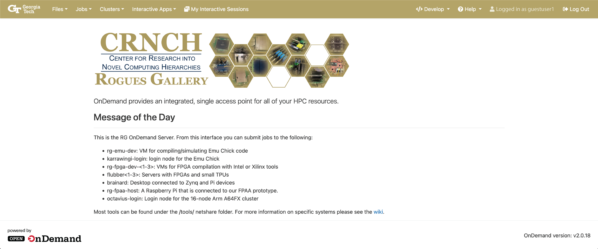

# CRNCH Open OnDemand

    

This is our main repository for the CRNCH Rogues Gallery implementation of Open OnDemand (OOD), which contains our config files and information on setting up a Jupyter-based workflow and graphical user interface. For more information on Open OnDemand, we recommend reading through their latest [architecture documentation](https://osc.github.io/ood-documentation/latest/architecture.html).

## Prerequisites
* Open OnDemand 2.0.18, which can be installed from the standard OOD instructions [here](https://osc.github.io/ood-documentation/latest/requirements.html). 
* Slurm for batch job and interactive scheduling
* TurboVNC for graphical applications that require a desktop. Typically we build from source for target platforms that don't have a default package (like aarch64).

## Currently Supported Platforms
* Octavius - CRNCH's Arm A64FX sixteen node cluster. See more information on this system [here](https://gt-crnch-rg.readthedocs.io/en/main/arm/octavius-a64fx-testbed.html).

## Sub-Module Repositories
Each repository contains additional 
* [Batch Connect - OSC Jupyter](https://github.com/gt-crnch-rg/bc_osc_jupyter) - Forked version of the OSC Jupyter batch process repo with updated config files for our setup.
* [Open OnDemand Configuration](https://github.com/gt-crnch-rg/crnch_ood_config) - Includes general setup configs and template configuration files.
* [CRNCH Notebook Examples]() - Different example notebooks that users can either pick up and use independentantly or that they can launch using templates with OOD.

## Future Work
* We are looking to extend this interface for other types of nodes including our FPGA platforms (Vitis, Quartus, OneAPI), and our local neuromorphic hardware platform (Scilab/XCos and related scripts). 
